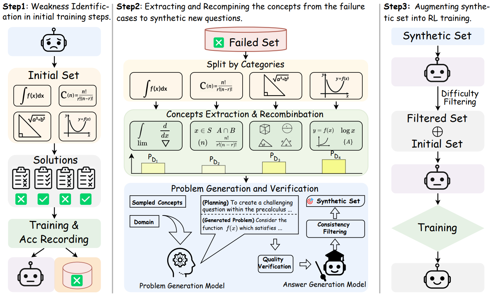

<h1 align="center">

 
<!--   -->
SwS: A Weakness-driven Problem Synthesis Framework
</h1>

  <a href="https://mastervito.github.io/MasterVito.SwS.github.io/"><b>[🌐 Website]</b></a> •
  <a href=""><b>[🤗 Demo Dataset]</b></a> •
  <a href="https://arxiv.org/pdf/2506.08989"><b>[📜 Paper]</b></a> •
  <a href="https://github.com/MasterVito/SwS"><b>[🐱 GitHub]</b></a> •
  <a href="https://x.com/weizhuchen/status/1933194338114433470?s=46"><b>[🐦 Twitter]</b></a>

Repo for "<a href="https://arxiv.org/pdf/2506.08989" target="_blank">SwS: Self-aware Weakness-driven Problem Synthesis in Reinforcement Learning for LLM Reasoning</a>"

    
         
    <em>Figure 1: 32B model performance across mainstream reasoning benchmarks and different domains.
    </em>

## 🔥 News

<!-- - [2023/10/13] 🔥🔥🔥 We release a demo for ToRA at [🐯 Gradio](https://9557c5365a6f44dc84.gradio.live), try it out!!! -->
- [2023/06/10] Our full code and datasets are under review by Microsoft and will be released upon approval.
- [2023/06/10] SwS paper, repo, website and demo datasets released.

## 💡 Introduction 

The Self-aware Weakness-driven problem Synthesis framework (SwS) framework proposes to identifies model deficiencies and leverages them for problem augmentation. The weaknesses are defined as questions that the model consistently fails to learn through during RL training. SwS extracts the core concepts from these failure cases and synthesize new problems to strengthen the model's weak areas in subsequent augmented training, enabling it to focus on and gradually overcome its weaknesses.

 

    
     
    <em>Figure 2: An overview of our proposed weakness-driven problem synthesis framework that targets at mitigating the model’s reasoning limitations within the RLVR paradigm.
</em>

### Evaluation Results

